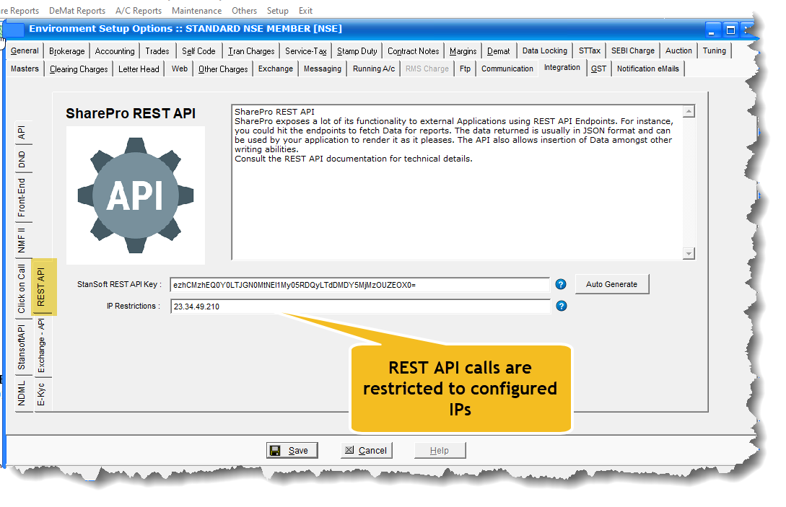

**The REST API can be tested at the UAT url:**

*http://cloud.stansoftware.com:81/shrdbms/dotnet/api/stansoft/endpoint*

An example of a REST API call at the UAT is shown below:

*http://cloud.stansoftware.com:81/shrdbms/dotnet/api/stansoft/ClientPANCheck*

**UAT API Key**: ezhDMEI5ND4MLE3YwNH0=

:::note

Note that the REST API will be IP protected, meaning that only configured IP addresses in SharePro *Environment setup* will be able to access the REST API calls. 

:::
 
 
 
 **See the snapshot below:**

 