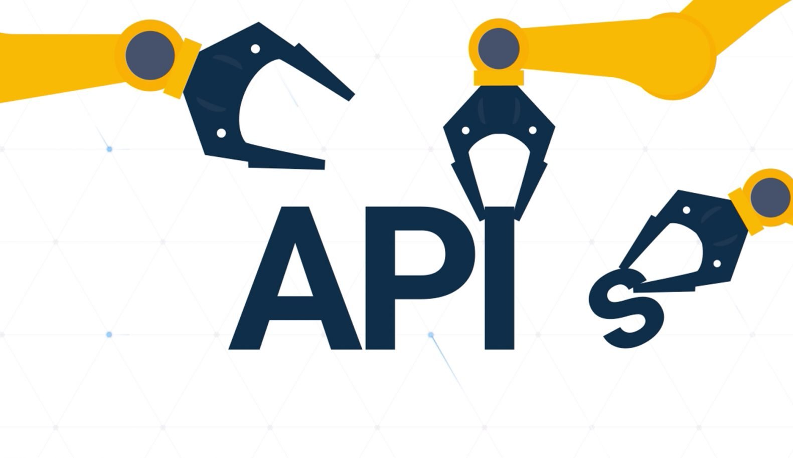
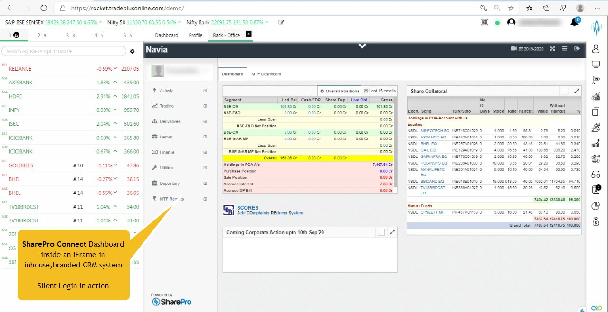
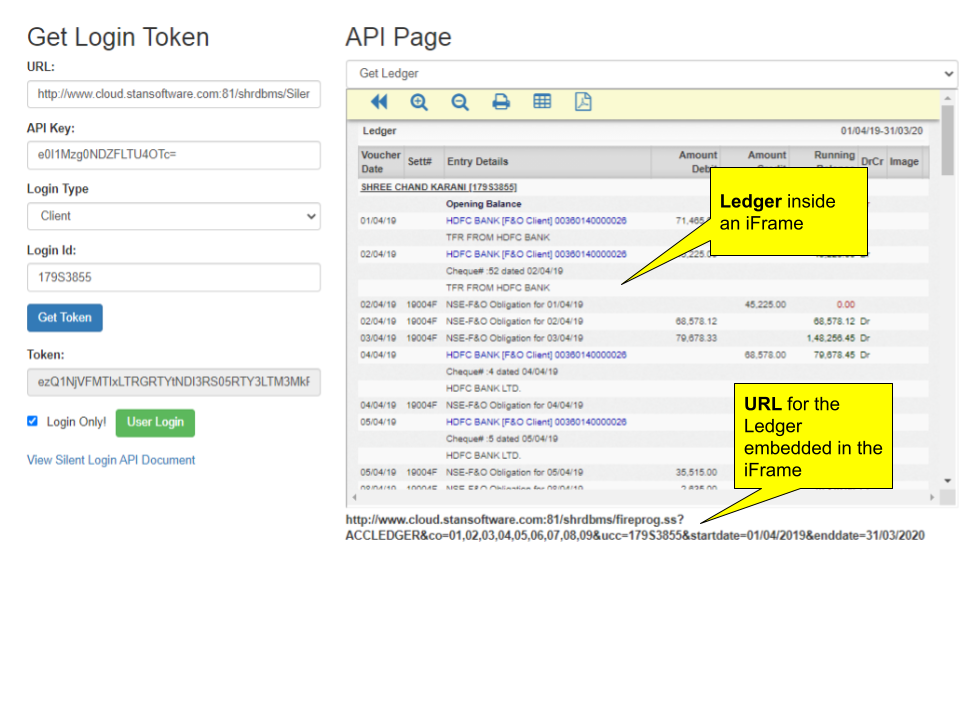

<span style={{"font-size":"26px"}}>
Technical Documentation
</span>
<span style={{"font-size":"20px"}}>
Revision: Feb 2023
</span>
<span style={{"font-size":"26px"}}>
This is a confidential document
</span>




<span style={{"font-size":"30px"}}>
Standard Software (P) Limited<br/>699F, Block P, New Alipore, Kolkata (033) 2400 8804
</span>


<span style={{"font-size":"32px"}}>
What is Silent Login?
</span>
<span style={{"font-size":"20px"}}>
You can use the *Silent Login* API to integrate the pages served by **SharePro Connect** to a third-party application, like the browser-based Trading software, a Mobile App or an inhouse-CRM system. The reports -  like Ledgers, Trade registers, Portfolio, DP Holdings, etc.- or utility pages - like Online Payments, Pledge Initiations, Dashboard,  etc.- and almost anything - can be integrated right into these applications without the user having to log in once again.

**Use cases:**
  1. Your browser-based trading engine or your CRM could have a [Backoffice] button. The user clicks on the button a new browser window opens up with your user at the SharePro Connect **Dashboard** *without having to log in a second time.*


2. You have a Trading Cell phone App *[or an in-house CRM system, a third Party Portal, Cellphone App  or even a Web front-end trading system]* where your Client, AP, Branch Manager, etc., may log in first. The user during the process of trading on the App clicks on the, say, Ledger, link provided on the App and a fully responsive Ledger opens up inside the trading application straightaway. This is achieved by embedding a SharePro connect URL inside an iframe.

3. The cellphone app, post silent login, calls a SharePro Connect URL that enables payment through a payment gateway. The client makes online Payment through the cell phone Trading App. The moment the payment gets through, his available exposure is increased within seconds.<br/>**This also requires front-end integration*

4. The in-house branded CRM’s dashboard has an iframe that shows a table containing segment-wise Ledger balances of the client. The iframe embeds a SharePro Connect URL.


In all the above cases, what has happened behind the scenes is that your App has performed a *Silent Login* to **SharePro Connect** using the API structure. Once the login is successful, your App simply calls the relevant URLs to integrate the SharePro Connect features into the application.
</span>

<span style={{"font-size":"25px"}}>
Now let us understand how Silent Login can be implemented

**Step I: Setup API Key**

</span>
<span style={{"font-size":"20px"}}>
The first thing to do is to create a secret and long key that will be used by the third-party tool or trading engine to connect to SharePro. To do this, go to environment setup and do as shown below:


.png>)

As seen in the image, the key is pretty long and extremely hard to remember. Note that you can click on the “Auto-generate” button to allow SharePro to generate a complex key for you.
</span>

<span style={{"font-size":"25px"}}>
**Step II: Share the Secret key**
</span>
<span style={{"font-size":"20px"}}>
The *Secret Key* generated above has to be kept, well, a secret. This means that it is strongly advised that it not be shared with unauthorised users. It now has to be shared with the third party or inhouse developer for the purpose of integration

The developer can now use the key as follows: WARNING: Techy stuff ahead
</span>
<span style={{"font-size":"25px"}}>
**Step - II: Fetching the token**
</span>

<span style={{"font-size":"20px"}}>
The application shall have to fetch a token from the SharePro Connect by using the API Key shared above. Basically, the application will need to submit the following information to receive a token in return:

1. **apikey**: The secret key we generated in step I
2. **logintype**: Values can be CLIENT/BRANCH/SUB-BROKER
3. **login id** : The UCC of the client, the username of the Branch user or the code of the AP, respectively
</span>
<span style={{"font-size":"20px"}}>
This is to be done in either of the following ways:
1. **Submitting a FORM-POST**: This is the preferred method as passing this data through https:// fairly secures the exchange. A sample REST API call using the Restsharp library could be :
</span>
```
var client = new RestClient("localhost/shrdbms/SilentSessionRegister.ssnp");
        client.Timeout = -1;
        var request = new RestRequest(Method.POST);
        request.AlwaysMultipartFormData = true;
        request.AddParameter("apikey", 
    "ezI4NkUxRkFELUVDNTEtNEJFQS04MzY5LTg2NDdFMjQ1NjlFMH0=");
        request.AddParameter("logintype", "CLIENT");
        request.AddParameter("loginid", "CBA00323");
        IRestResponse response = client.Execute(request);
        var token=response.Content;
```
**Below is the Postman snapshot to see how this works:**     
.png>)

<span style={{"font-size":"20px"}}>
2. **Hitting the server with Query Parameters embedded in the URL**: This is not the preferred method, but you can even fetch the same token by hitting a URL like:
</span>
```
<<backoffice.url>>/shrdbms/SilentSessionRegister.ssnp?apikey=<apikey>                
                &LoginType=<logintype>&loginid=<loginid>
```
<span style={{"font-size":"20px"}}>
**A sample URL could be :**
</span>
```
http://localhost/shrdbms/SilentSessionRegister.ssnp?apikey=ezUxRUE0MjM4LUQ1NTxQjIyQkFDNUI4MH0=
                &LoginType=CLIENT&LoginId=MK01
```
where ezUxRUE0MjM4LUQ1NTEtNDhCMS1CMEQ4LUMxQjIyQkFDNUI4MH0= is the **API key**, CLIENT is the **login type** and MK01 is the **UCC of the Client.**

<span style={{"font-size":"20px"}}>
**Be advised that the above call should be made by the Server application thus completely hiding the operation from the end-user at the browser end. Not adhering to this principle may lead to a security leak at your responsibility. More about this in the “Security Considerations” later.**

3. If something is not well, like the API key is invalid, the call returns an error string like “ERROR:.......```<<message>>```. But if all is well, it returns a long string which is called a token.

4. Once the Token has been received,  the next step is to hit another URL on the **SharePro Connect** server with the token. This URL could be hit in a new browser window to log in the user and open up the backoffice dashboard. This URL is of the format :
</span>
  ``` <<backoffice.url>>/shrdbms/userlogin.ss?login=silent&token=<<sessionID>>```

  **A sample could be :**
        
        ```http://localhost/shrdbms/userlogin.ss?login=silent&token=ezS04RDNFLUZFOUFFNkUwQUVFQn0=```

<span style={{"font-size":"20px"}}>
That's it. The login is complete and the user passed in the initial hit has logged in to SharePro Connect and a proper session has been established. Now all your application has to do is to window has the user pre-logged in. See the following snapshot where a user is pre-logged        

.png>)

5. What if we want our application to simply log the user in, create the sessions and ignore the dashboard. This will prepare the App to make future hits to specific pages. For instance, you may not want to open a new browser window in a CellApp but rather just log in and provide links to various reports like Ledger, Portfolio Statements or allow Online Payment.

To do this, you need to add an additional parameter as follows:
</span>
                                action=loginonly

<span style={{"font-size":"20px"}}>
**So the URL we used to login and show the dashboard can be modified as follows to only do a silent login:**
</span>
``` <<backoffice.url>>/shrdbms/userlogin.ss?login=silent&token=<<sessionID>>&action=loginonly```

<span style={{"font-size":"20px"}}>

In which case the system does not return the dashboard, but simply logs in the user for future URL hits. It returns a string: “SUCCESS: LOGIN SUCCESS” or “ERROR: LOGIN FAILED”. In case of success, the calling app can virtually access all pages of the SharePro App and serve them to the user in its own window. See the example usage given below.

6. The thing to note is that your application can save the cookie called returned by the above call for future use. The cookie is called ShrdbmsSessionid.

.png>)
</span>


<span style={{"font-size":"25px"}}>
Let us see Silent Login in action [walkthrough]
</span>

<span style={{"font-size":"20px"}}>
1. The 3rd Party or inhouse application hits the following URL in the background:

***http://localhost/shrdbms/SilentSessionRegister.ssnp?***<br/>*apikey=e0I1Mzg0NDZFLTU4OTctNDefffc0OC05M0ZELTY3ODM3MUM1ODdDNH0=&LoginType=CLIENT&LoginId=M3567*

2. SharePro returns a Token. Say, it returns the following string:<br/> *e0NBOEExMUNFLTkwOUQtNDg1RS05NjM3LTAyQ0FDQzIxNjM3Mn0=*

3. We use the Token to log in to **SharePro Connect**. We use javascript in our application to open a new browser window and immediately move the **SharePro Dashboard** using this URL.

***http://localhost/shrdbms/userlogin.ss?***<br/>*login=silent&token=ezVEODUwNjAyLTZFQjMtNDEzNS05OTc1LTlDMEFGOTc2NzEyN30=*<br/>

Alternatively, your application hits the following URL in the background and simply logs the Client into **SharePro** without even showing the dashboard. Once done, all the URLs published in SharePro become available to the application. This way, once (4) is done, the app can simply hit SharePro Urls to see ledgers, reports, etc.

***http://localhost/shrdbms/userlogin.ss?***<br/>*login=silent&token=e0RDQ0IwRjVELTdBMzktNDY0MS05MTZCLUM2NjNDQUUyQzUxMn0=&action=loginonly*<br/>

This hit returns one of the following :<br/>
             *ERROR:LOGIN FAILED or SUCCESS:LOGIN SUCCEEDED*
</span>


<span style={{"font-size":"25px"}}>
**Standard Query Parameters**
</span>

<span style={{"font-size":"20px"}}>
While constructing the URL for displaying a report, there are some standard parameters that can be used. Here is a list:
</span>

<span style={{"font-size":"18px"}}>
|Param Name|Explanation|Samples|
|:---|:---|:---|
|co|Company code. A code represents each segment in SharePro, usually, 01,02,03., etc. This list is available in the Company Setup option in the desktop application.[you can use segments instead]|01<br/>01,02,03<br/>ALL<br/>|
|segments|A list of segments required in the report. Can send the shortcode of the segment or an extended code, Here is a list:<br/> * **NSE**-----**NSE-CM**<br/> * **NSE**-----**NSE-CM**<br/>* **BSE**-----**BSE-CM**<br/>* **NFO**-----**NSE-F&O**<br/>* **MCFO**-----**MCX**<br/>* **NCFO**-----**NCDEX**<br/>* **CNFO**-----**NSE-CDS**<br/>* **NSLB**-----**NSE-SLBM**<br/>* **NMFS**-----**NSE-MF**<br/>|NSE,NFO,NCFO<br/>NSE-CM,NSE-F&O,MCX<br/>ALL<br/>|
|branchid|Branch ID, if the report is required for a particular branch,|HO<br/>KOL,MUM<br/>|
|stno|Settlement Number|2022022|
|sttype|Settlement Type|N<br/>W<br/>Z<br/>|
|date|Date for the report.<br/>For example, you can pass a string in dd/mm/yy format to the trade register to see the register for a particular date<br/>|22/08/22|
|datefrom|Starting Date for the report|01/04/22|
|dateto|the Ending Date for the report|31/03/23|
|ucc|The UCC of a client, if required|ABS|
|accyear|account year from the QueryString|2223|

</span>
---

<span style={{"font-size":"20px"}}>
Apart from using the Standard Query Parameters for reports listed above, you might want to send the value of a checkbox or a dropdown in the query parameter. What is the key to send can be inspected from the browser Inspect tool as shown in the snapshot below.
</span>


<span style={{"font-size":"20px"}}>

The **silentlogin_hint** attribute of the control is in the format <br/>```“<<variableName>>|<<type>>”```. So, if you need the effect of a particular checkbox to be ON, you should inspect the checkbox, note down the **silentlogin_hint** and add the ```“<<variableName>>=<<value>>”``` in the querystring.

</span>


<span style={{"font-size":"26px"}}>

<u> ***Silent Login done, some sample URLs*** </u>
</span>

<span style={{"font-size":"20px"}}>
Remember that almost all of the SharePro Connect URLs can be inspected and used by you in your application as the user has already logged in.

Here are some sample URLs:

For example, the following URL will start off the Payment Request module on the browser:
</span>
 
***http://localhost/shrdbms/html/webchequerequest.swcx***

```
The following URL gives the Accounting ledger dialog
```

***http://localhost/shrdbms/fireprog.ss?ACCLEDGER***

```
Ledger Data with Date Filter
```

***http://localhost/shrdbms/fireprog.ss?ACCLEDGER&co=01,02,03,04,05,06,07,08,09&ucc=179S3855&startdate=01/04/2019&enddate=31/03/2020***

```
Ledger with Reverse Date Order
```

***http://localhost/shrdbms/fireprog.ss?ACCLEDGER&co=01,02,03,04,05,06,07,08,09&ucc=179S3855&lReverseDateOrder=.T.&startdate=01/04/2019&enddate=31/03/2020***

```
Ledger With Vallan Details
```

***http://localhost/shrdbms/fireprog.ss?ACCLEDGER&co=01,02,03,04,05,06,07,08,09&ucc=179S3855&lPrintVallan=.T.&startdate=01/04/2019&enddate=31/03/2020***

```
Ledger with Cash and Share Margin
```

***http://localhost/shrdbms/fireprog.ss?ACCLEDGER&co=01,02,03,04,05,06,07,08,09&ucc=179S3855&ShowCash_ShareMargin=.T.&startdate=01/04/2019&enddate=31/03/2020***


```
Some URLs may require you to pass the ShrdbmsSessionid cookie value that has 
the SharePro sessionId. For instance,  using the following URL will show the Live 
Trades as they are being executed in the frontend engine:
```

***http://localhost/shrdbms/dotnet/mobile/livetrades.aspx?sessionid= ```<<m.cShrdbmsSessionId>>```***

<span style={{"font-size":"20px"}}>
The available URLs can be provided or found by inspecting SharePro connect itself
</span>


<span style={{"font-size":"22px"}}>
***Check Demo*** using SharePro Silent Login API Tracker
</span>


***http://www.cloud.stansoftware.com:81/shrdbms/dotnet/StanSoftAPI/SilentLoginAPITracker.aspx***




<span style={{"font-size":"20px"}}>

**Things to know:**
```
1. The Token generated by the mechanism has a validity of only 1 
day and automatically expires the next day.
```


**Security Considerations**


You must consider the following security issues while implementing Silent Login into your systems.
```
1. Your SharePro Connect server should preferably be behind an https 
connection.

2. The FORM-POST method is the preferred method to make a 
SilentSessionRegister call.

3. Since SharePro uses the X-Frame-Options=SAMEORIGIN directive, it will be 
possible to show the contents of a SharePro connect page in an iframe if 
both the applications work on the same domain.
```

</span>


 


